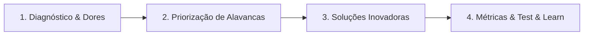

# GUIA ESTRATÉGICO DE PREPARAÇÃO: DINÂMICA ONLINE iFUTURE 2027 (iFOOD)
> **Dossiê de Alto Desempenho para Aprovação na Dinâmica em Grupo (Plataforma Kolab)**  
> **Tema do Webcase:** *"A nova fronteira do iFood na alimentação fora do lar — O iFood Agora é Comer Fora"*

---

## 1. Raio-X do Webcase & Contexto de Negócio

O iFood domina o delivery digital no Brasil (+60 milhões de pedidos/mês, +1.500 cidades). Contudo, o delivery representa apenas uma fração do consumo total de refeições no país. O grande oceano azul está no **salão físico dos restaurantes**.

### Os Números de Ouro do Pré-Work (Decore e Cite na Dinâmica):
- **R$ 495 Bilhões em 2025:** É a movimentação anual estimada do setor de Alimentação Fora do Lar no Brasil segundo a Abrasel. Este é o TAM (Total Addressable Market) que o iFood está disputando com o "Comer Fora".
- **60% dos Consumidores:** Ainda pedem ou interagem via redes sociais ou WhatsApp, fora de aplicativos dedicados. Há uma informalidade massiva e uma oportunidade gigantesca de digitalização e CRM.
- **Apenas 24% dos Parceiros:** Possuem operação verdadeiramente híbrida (Salão + Delivery integrados). 76% dos restaurantes ainda operam de forma fragmentada, gerando ineficiências operacionais.
- **Cidades Piloto Atuais:** Belo Horizonte, Brasília, Campinas, Curitiba e São Paulo.

### A Tese Estratégica do iFood:
O iFood quer deixar de ser apenas "o app que entrega comida na sua porta" para se tornar **o ecossistema completo de alimentação do brasileiro**, acompanhando o cliente antes de sair de casa, durante a refeição na mesa e após a visita.

---

## 2. A Jornada Presencial 360° & As Soluções do Ecossistema

O pré-work estruturou a jornada em 6 etapas claras. Dominar onde estão as dores e quais ferramentas o iFood já possui é o que fará você soar como uma verdadeira consultora de negócios durante a dinâmica:

| Etapa da Jornada | O que o Consumidor faz | A Solução do iFood Salão | Dor que Resolve |
| :--- | :--- | :--- | :--- |
| **1. Descobrir** | Mapeia opções no app | App iFood ("Comer Fora") + iFood Ads | Falta de visibilidade dos restaurantes e indecisão do cliente |
| **2. Escolher** | Avalia menus, fotos e ofertas | Cardápio Digital + Avaliações | Cardápios em PDF desatualizados ou sem preços claros |
| **3. Reservar** | Garante sua mesa ou entra na fila | Gestão Inteligente de Reservas & Filas | Filas em pé na calçada e frustração por falta de mesa |
| **4. Visitar** | Chega ao local e faz check-in | Check-in via Geolocalização no App | Dificuldade do restaurante em saber quem está entrando |
| **5. Consumir** | Faz pedidos e aproveita o salão | Cardápio Digital + Pagar na Mesa + PDVs | Garçom sobrecarregado, demora para pedir e demora para pagar |
| **6. Retornar** | Paga, recebe benefícios e avalia | Cashback + Fidelidade + CRM Integrado | Restaurante perde contato com o cliente após ele pagar |

---

## 3. Proposta de Resolução de Case em 4 Passos (Método iFood)

Durante a dinâmica, o grupo receberá uma pergunta-problema (ex.: *"Como aumentar a adoção do Comer Fora entre restaurantes parceiros?"* ou *"Como convencer o consumidor a usar o iFood dentro do restaurante?"*).

Assuma a liderança facilitadora propondo a divisão da discussão neste framework clássico de tecnologia:

### Passo 1: Diagnóstico e Dores dos Stakeholders
- **Dor do Restaurante:** Sexta e sábado o salão lota e há gargalo no atendimento (garçom demora a trazer a conta e o cardápio, diminuindo o giro de mesas). De terça a quinta, as mesas ficam vazias (ociosidade). Além disso, não conhecem o perfil do cliente do salão (diferente do delivery onde têm dados).
- **Dor do Consumidor:** Esperar 25 minutos na fila de espera, ter que chamar o garçom três vezes para pedir a conta e dividir com amigos, e a falta de promoções atrativas no presencial.
- **Dor do iFood:** Conectar o tráfego do app à ida ao restaurante físico sem canibalizar o delivery e educando tanto garçons quanto clientes.

### Passo 2: Priorização das Alavancas de Negócio
Para o iFood vencer no mercado de R$ 495 Bi, ele precisa de duas alavancas principais:
1. **Otimização do Giro de Mesas (Table Turnover):** Se cada mesa rodar 15 minutos mais rápido porque o cliente pagou direto pelo celular com *Pagar na Mesa*, o restaurante atende mais clientes no horário de pico (+15% a +25% de faturamento).
2. **Combate à Ociosidade (Dias Úteis):** Usar inteligência de dados e cupons dinâmicos para atrair clientes para o salão de terça a quinta com *iFood Benefícios* e cashback.

### Passo 3: Três Ideias Inovadoras para Você Propor na Dinâmica
Traga ideias concretas prontas para impressionar os avaliadores:

#### 💡 Ideia A: "Garçom Parceiro & Gamificação no Salão"
- **O Desafio:** O garçom muitas vezes vê o cardápio digital e o pagamento no app como uma ameaça à sua gorjeta ou trabalho.
- **A Solução:** Garantir a taxa de serviço (gorjeta de 10-13%) diretamente integrada no checkout do app *Pagar na Mesa*, com repasse automático e transparente para os garçons, além de bonificação do iFood para o garçom que incentivar o check-in no app.
- **Fit com Melissa:** Conecta com sua expertise em *Gamificação Organizacional* no Dragão do Mar e processos de remuneração/benefícios no BNB.

#### 💡 Ideia B: "Clube iFood Omnichannel (Cashback Cruzado Delivery ⇄ Salão)"
- **O Desafio:** Fazer os usuários de delivery usarem o serviço de salão e vice-versa.
- **A Solução:** Quem consome no delivery acumula créditos/cashback exclusivos para usar no salão dos mesmos restaurantes no fim de semana. Quem come no salão ganha frete grátis ou cupom para o delivery nos dias de semana chuvosos.
- **Fit com Melissa:** Foco em retenção, LTV (Lifetime Value) e estímulo do ecossistema bilateral.

#### 💡 Ideia C: "Cardápio Inteligente com IA & Pré-Pedido no Trajeto"
- **O Desafio:** Clientes em almoço corporativo (especialmente com *iFood Benefícios*) têm tempo limitado (1 hora).
- **A Solução:** Pelo app, enquanto caminha até o restaurante, o cliente escolhe a mesa reservada e já faz o pedido preliminar das bebidas e pratos principais. Ao sentar, os pratos são servidos quase instantaneamente.
- **Fit com Melissa:** "AI First" — premissa central descrita pelo iFood no edital do programa iFuture!

### Passo 4: Métricas de Sucesso (KPIs)
Finalize sempre sua fala conectando a proposta a métricas mensuráveis:
- **GMV Físico:** Volume financeiro transacionado nas mesas via iFood.
- **Giro Médio de Mesa:** Redução do tempo médio de ocupação por mesa (ex: de 75 min para 55 min).
- **Taxa de Adoção do Pagar na Mesa (%):** % de contas fechadas sem maquininha física tradicional.
- **Retenção & Frequência de Visitas (Cohorts):** Quantas vezes o consumidor retorna ao mesmo parceiro em 30 e 60 dias.
- **NPS B2B e B2C:** Satisfação do dono do restaurante e do cliente final.

---

## 4. Roteiro Prático de Postura e Frases de Ouro na Plataforma Kolab

A dinâmica em grupo online não avalia quem fala mais alto, mas sim **quem agrega valor com clareza, escuta ativa e mantém o grupo no rumo certo**:

### 🎯 Os 4 Papéis da Dinâmica e Como Melissa Deve se Posicionar:
1. **O Cronometrista Estratégico:** Controlar os minutos sem ser chata, garantindo que o grupo chegue a uma conclusão a tempo.
2. **O Sintetizador de Ideias:** Resumir o que dois colegas falaram e amarrar numa proposta viável.
3. **O Embaixador dos Dados:** A pessoa que resgata os dados do pré-work (R$ 495 Bi, 60% WhatsApp, 24% híbrido) para embasar a decisão.
4. **O Foco no Apresentável:** Lembrar a equipe de que nos últimos 5 minutos é preciso definir o pitch final.

### 🗣️ Frases de Ouro para Usar na Prática:

#### Ao iniciar o debate do grupo:
> *"Pessoal, muito prazer! Para otimizarmos nosso tempo de resolução, o que acham de gastarmos os primeiros 5 minutos alinhando o problema principal e as dores dos restaurantes e clientes, 10 minutos nas soluções e os últimos 5 minutos fechando os slides e quem vai falar cada ponto?"*

#### Para puxar os dados do pré-work com autoridade natural:
> *"Concordo muito com o ponto do [Colega]. E vale lembrarmos um dado muito forte que o iFood trouxe no material de pré-work: hoje 60% das pessoas pedem fora de apps dedicados, e só 24% dos restaurantes têm operação híbrida. Nossa solução precisa ser muito simples para o restaurante adotar no salão sem atrito."*

#### Para destravar um debate longo ou divergência:
> *"Temos duas ideias ótimas na mesa: a ideia de [Pessoa A] focada no cliente e a de [Pessoa B] focada no restaurante. Como o iFood é um ecossistema de duas pontas, que tal integrarmos as duas: usar o incentivo de cashback para atrair o cliente e o giro rápido de mesas para convencer o dono do restaurante?"*

#### Para fechar e organizar a apresentação:
> *"Faltam 5 minutos para voltarmos para a sala principal. Vamos estruturar nossa fala em 4 blocos rápidos de 30 segundos cada: Problema ➔ Solução ➔ Benefício para o Ecossistema ➔ Métricas. Quem gostaria de abrir a introdução?"*

---

## 5. Como Conectar sua Própria História (Melissa) ao Case

Se os avaliadores perguntarem sobre sua experiência ou pedirem para você se apresentar rapidamente (pitch de 30-45 segundos):

> *"Sou a Melissa, estudante do 4º semestre de Administração na UFC. No Banco do Nordeste, atuo em Gestão de Pessoas em uma célula responsável por mais de 7 mil colaboradores, onde vivo diariamente o tratamento rigoroso de grandes bases no Excel para transformar dados em decisões operacionais e de clima. Em paralelo, presidi o Dragão do Mar na UFC, onde aprendi na prática a liderar squads voluntários com foco em governança, rituais ágeis e metas no Notion. Me identifico profundamente com o ecossistema do iFood porque uno a mentalidade de dona com o raciocínio analítico para resolver problemas que geram impacto em larga escala."*

---

## 6. Simulado: 5 Perguntas Capciosas dos Avaliadores e Respostas

### Pergunta 1: *"E se o dono do restaurante achar que o iFood vai cobrar taxas abusivas também no salão e recusar o sistema?"*
- **Resposta:** *"O posicionamento de entrada do iFood Salão deve focar em ganho de eficiência e volume. Em vez de uma taxa pesada sobre o faturamento total, o argumento de venda é o giro de mesas: ao reduzir 15 minutos de espera na conta com o 'Pagar na Mesa', o restaurante consegue fazer 1 ou 2 giros extras no horário de pico. Além disso, o iFood pode oferecer planos escalonados e testes pilotos sem custo fixo inicial, alinhado à cultura de 'test & learn'."*

### Pergunta 2: *"Como convencer o cliente a abrir o app do iFood estando fisicamente dentro do restaurante?"*
- **Resposta:** *"Através de conveniência real e benefício imediato: um QR Code inteligente na mesa que concede cashback instantâneo na conta ou acesso a benefícios do Clube iFood, sem a necessidade de esperar pelo garçom para ver o cardápio ou pedir a conta. A dor da demora no fechamento da conta é universal."*

### Pergunta 3: *"Isso não pode canibalizar o negócio de delivery do iFood?"*
- **Resposta:** *"Pelo contrário, é uma expansão do TAM. O mercado fora do lar movimenta R$ 495 bilhões. O consumidor não deixa de pedir delivery na chuva ou à noite em casa porque saiu para jantar no sábado; ele simplesmente já frequenta restaurantes. Ao estar presente no salão, o iFood passa a monetizar e capturar dados de momentos de consumo onde antes ele era 100% cego."*

### Pergunta 4: *"Como a Inteligência Artificial entra nessa solução (AI First)?"*
- **Resposta:** *"Em três frentes: 1) Previsão de demanda e ocupação para os restaurantes ajustarem compras no iFood Shop; 2) Recomendação hiperpersonalizada de pratos no cardápio digital com base no histórico do cliente; e 3) Otimização dinâmica de descontos em horários de menor movimento do salão."*

### Pergunta 5: *"O que vocês fariam se o tempo de dinâmica estivesse acabando e o grupo ainda não tivesse chegado a um consenso?"*
- **Resposta:** *"Priorizaria o objetivo coletivo com pragmatismo: proporia escolher a solução mais simples e viável que resolva a dor principal, combinaria a métrica de validação e garantiria que todos tivessem um papel definido na apresentação final. No iFood, errar rápido e entregar é melhor que perfeccionismo sem entrega."*
