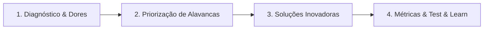

# GUIA ESTRATÉGICO DE PREPARAÇÃO: DINÂMICA ONLINE iFUTURE 2027 (iFOOD)
> **Dossiê de Alto Desempenho para Aprovação na Dinâmica em Grupo (Plataforma Kolab)**  
> **Tema do Webcase:** *"A nova fronteira do iFood na alimentação fora do lar — O iFood Agora é Comer Fora"*  
> **Atualizado com:** Dados FY2026 (Prosus), iFood MOVE 2026, Livro "Código Aberto" (Raphael Bozza) e pesquisa Glassdoor/Forbes

---

## 1. Raio-X do iFood em 2026 — Contexto Estratégico Atualizado

### O iFood Hoje (Dados Prosus FY2026 + iFood MOVE 2026)
- **Receita Líquida:** R$ 10,1 bilhões (+40% YoY)
- **EBITDA Ajustado:** R$ 2,2 bilhões (+56% em USD)
- **Volume Financeiro Movimentado:** R$ 150 bilhões (pedidos + serviços financeiros)
- **Pedidos Mensais:** +180 milhões/mês (pico: 22M em um fim de semana)
- **Estabelecimentos Parceiros:** 500 mil em +2.000 municípios
- **Usuários Ativos:** 65 milhões
- **Entregadores Parceiros:** 600 mil
- **Investimento Aprovado FY27:** R$ 24 bilhões (+41%)
- **Diversificação:** Negócios além do delivery já são 33% da receita

### Liderança-Chave (Decore os Nomes!)
| Cargo | Nome | O que Saber |
| :--- | :--- | :--- |
| **CEO** | **Diego Barreto** | Ex-CFO, CEO desde mai/2024. Arquiteto do plano de R$ 24 Bi. Filosofia: "IA multiplica a ação, mas NÃO substitui o julgamento humano." |
| **Chairman** | **Fabrício Bloisi** | Fundador da Movile, ex-CEO iFood (2019-2024). Agora CEO Global Prosus/Naspers. |
| **VP Impacto/ESG** | **Luana Ozemela** | Forbes "Mulheres + Influentes 2026". Lidera DEI e iFood Regenera. |
| **VP Pessoas** | **Gustavo Vitti** | Responsável pelo recrutamento e cultura. Autor do framework de IA para RH. |
| **CFO** | **Pedro Pereira** | Assumiu em abril/2026, ex-Global Investment Partner da Prosus. |

### Cenário Competitivo (Pode Surgir no Case!)
- **Market Share iFood:** 80-89% do delivery BR
- **Parceria iFood + Uber:** Assinatura conjunta R$ 21,90/mês (Clube iFood + Uber One). Corridas Uber pelo app iFood!
- **Clube iFood:** Já responde por **45% do volume total de entregas**
- **Keeta (Meituan):** Gigante chinesa investindo R$ 5,6 Bi no Brasil, taxas baixas para PMEs em SP
- **Rappi (~9%):** Superapp com Turbo 10 min, farmácias, carteira PicPay
- **99Food:** Relançada em capitais com sinergia 99Moto
- **Acordo CADE (TCC até 2027):** Sem exclusividade com redes de 30+ lojas; limite de 25% de GMV exclusivo

---

## 2. O Webcase "Comer Fora" — Dados do Pré-Work + Intel Atualizada

O iFood domina o delivery digital no Brasil, mas o delivery é fração do consumo total. O grande oceano azul está no **salão físico dos restaurantes**.

### Os Números de Ouro do Pré-Work (Decore e Cite na Dinâmica):
- **R$ 495 Bilhões em 2025:** TAM do setor de Alimentação Fora do Lar (Abrasel)
- **60% dos Consumidores:** Pedem via redes sociais ou WhatsApp, fora de apps
- **Apenas 24% dos Parceiros:** Possuem operação híbrida (Salão + Delivery integrados)
- **50+ Cidades Ativas em 2026:** Expandiu dos 5 pilotos iniciais (BH, BSB, Campinas, CWB, SP) para mais de 50 cidades, incluindo RJ

### A Tese Estratégica do iFood:
Deixar de ser "o app que entrega comida na porta" para se tornar **o ecossistema completo de alimentação do brasileiro** — antes, durante e depois da refeição, em casa ou no restaurante.

### Tecnologias Novas no Salão (Atualizadas):
- **Get In & Tagme:** Parceiros integrados de reservas e filas virtuais no app
- **Totens & KDS (Kitchen Display Systems):** Digitalização do salão e cozinha
- **"Maquinona" iFood Pago:** Dispositivo próprio de pagamento integrado ao PDV
- **Portal do Parceiro com CRM Presencial:** Histórico de consumo, dias de pico, ticket médio

---

## 3. A Jornada Presencial 360° & As Soluções do Ecossistema

| Etapa da Jornada | O que o Consumidor faz | A Solução do iFood Salão | Dor que Resolve |
| :--- | :--- | :--- | :--- |
| **1. Descobrir** | Mapeia opções no app | "Comer Fora" geolocalizado + iFood Ads (R$ 1,2 Bi, +106% YoY!) | Falta de visibilidade e indecisão |
| **2. Escolher** | Avalia menus e ofertas | Cardápio Digital + **Toqan IA** (recomendação personalizada via LCM) | Cardápios desatualizados |
| **3. Reservar** | Garante mesa / entra na fila | Get In & Tagme integrados + previsão preditiva com IA | Filas na calçada, frustração |
| **4. Visitar** | Chega e faz check-in | Check-in QR Code + CRM integrado ao Portal do Parceiro | Restaurante "cego" sobre o cliente |
| **5. Consumir** | Pedidos e pagamento | Pagar na Mesa + Totens/KDS + Maquinona iFood Pago | Demora pela conta (MAIOR DOR!) |
| **6. Retornar** | Avalia e recebe benefícios | Clube iFood Omnichannel (45% do volume!) + Cashback cruzado | Perda de contato pós-visita |

---

## 4. Estratégia AI First — O iFood é uma AI Company

### Os Pilares de IA que Você Deve Citar:
- **LCM (Large Commerce Model):** Modelo fundacional PROPRIETÁRIO (parceria Prosus), treinado em dados de consumo gastronômico brasileiro. Faz hiperpersonalização de cardápio, busca e logística em tempo real
- **Toqan (IA para Restaurantes):** IA generativa + preditiva para parceiros — previsão de demanda, sugestão de preços, cardápio inteligente, gestão de marketing
- **190+ modelos ML em produção:** Bilhões de inferências/mês. Diego Barreto: *"Se fossem desligados, a operação pararia no mesmo segundo."*
- **Robô ADA:** Veículo autônomo para entregas em complexos e shoppings

### Framework de Maturidade Agêntica do iFood:
1. **Iniciante:** Respostas a FAQs
2. **Júnior:** Consulta autônoma a bases internas (sem ação)
3. **Pleno:** Executa via API em sistemas externos
4. **Sênior:** Orquestra fluxos autônomos ponta a ponta

### A Filosofia de Diego Barreto:
> *"A IA democratiza e multiplica a CAPACIDADE DE AÇÃO (código, escrita, triagem, rotas). Mas NÃO substitui o JULGAMENTO HUMANO — contexto, ética, acolhimento e responsabilidade final."*

---

## 5. Proposta de Resolução de Case em 4 Passos (Método iFood)

Durante a dinâmica, o grupo receberá uma pergunta-problema. Assuma a liderança facilitadora propondo este framework:

### Passo 1: Diagnóstico e Dores dos Stakeholders
- **Dor do Restaurante:** Pico lotado com gargalo no atendimento (garçom demora); dias úteis com mesas vazias; "cego" sobre o perfil do cliente do salão
- **Dor do Consumidor:** 25 min de fila, chamar garçom 3x para a conta, dividir a conta com amigos, falta de promoções no presencial
- **Dor do iFood:** Conectar tráfego do app ao restaurante físico sem canibalizar delivery, educar garçons e clientes

### Passo 2: Priorização das Alavancas
1. **Otimização do Giro de Mesas:** -15 min por mesa com Pagar na Mesa = +15% a +25% de faturamento no pico
2. **Combate à Ociosidade (Terça-Quinta):** Cupons dinâmicos via iFood Benefícios e cashback do Clube iFood

### Passo 3: Três Ideias Inovadoras

#### 💡 Ideia A: "Garçom Parceiro & Gamificação no Salão"
- **Desafio:** Garçom vê app como ameaça à gorjeta
- **Solução:** Gorjeta 10-13% integrada no checkout Pagar na Mesa + repasse via iFood Pago + bonificação por check-in. Toqan IA otimiza escala de garçons
- **Fit Melissa:** Gamificação no Dragão do Mar + benefícios/remuneração no BNB

#### 💡 Ideia B: "Clube iFood Omnichannel (Cashback Cruzado)"
- **Desafio:** Fazer users de delivery usarem salão e vice-versa
- **Solução:** Créditos delivery válidos no salão + frete grátis para quem come presencial. Integrado com parceria Uber One (R$ 21,90/mês). Clube já é 45% do volume!
- **Fit Melissa:** Retenção, LTV, ecossistema bilateral

#### 💡 Ideia C: "Cardápio Inteligente com LCM & Pré-Pedido"
- **Desafio:** Almoço corporativo (iFood Benefícios) — tempo limitado a 1h
- **Solução:** LCM personaliza recomendações, cliente a caminho faz pedido, senta com mesa servida
- **Fit Melissa:** AI First — premissa central do iFuture

### Passo 4: Métricas de Sucesso (KPIs)
- **GMV Físico:** Volume transacionado nas mesas via iFood
- **Giro Médio de Mesa:** De 75 min para 55-60 min
- **Taxa de Adoção Pagar na Mesa (%):** Contas fechadas sem maquininha tradicional
- **Retenção & Frequência (Cohorts):** Retorno ao mesmo parceiro em 30 e 60 dias
- **NPS B2B e B2C:** Satisfação do dono e do cliente
- **Receita de Ads no Salão:** Contribuição de iFood Ads (R$ 1,2 Bi total)

---

## 6. Ecossistema de Verticais do iFood (Conheça Todas!)

| Vertical | O que Faz | Dado-Chave |
| :--- | :--- | :--- |
| **iFood Pago** | Fintech: maquininhas, crédito, antecipação. CEO: Bruno Henriques | R$ 2,5 Bi receita (25% do total) |
| **iFood Benefícios** | Cartões flex multibenefício (pós-PAT). CEO: Arthur Freitas | Alimentação, Refeição, Mobilidade, Cultura, Saúde |
| **iFood Shop** | Marketplace B2B de suprimentos + embalagens biodegradáveis | Preços de atacado para bares/restaurantes |
| **iFood Ads** | Retail media, mídia patrocinada no app. VP: Sam James | R$ 1,2 Bi receita (+106% YoY) |
| **Envios iFood** | Logistics as a Service — frota aberta para pedidos fora do app | 600K entregadores para e-commerce, WhatsApp |
| **iFood Turbo** | Quick commerce: entregas 15-20 min (farmácia, pet, conveniência) | Expansão além de comida |
| **Comer Fora** | Experiência presencial omnichannel no salão | 50+ cidades em 2026 |

---

## 7. ESG, Diversidade & Impacto Social do iFood

### DEI (Liderança: VP Luana Ozemela)
- **40% de mulheres em alta liderança** (meta atingida)
- Signatário do MOVER (equidade racial), contratação afirmativa, aceleração de líderes negros
- Comitês: AfroFood, Pride, Mulheres no iFood, iFood PcD
- Suporte à transição de gênero (financeiro, médico, jurídico) e licença parental de gênero neutro

### Impacto Social
- **Potência Tech:** Dezenas de milhares de bolsas em programação/dados para populações sub-representadas
- **Meu Diploma:** +15 mil entregadores concluíram Ensino Médio (ENCCEJA + aulas + bonificação)
- **iFood Chega Junto:** R$ 744 milhões em iniciativas para entregadores (39 hubs, seguros, telemedicina)

### Sustentabilidade (iFood Regenera)
- R$ 300M+ em eletrificação (motos elétricas + iFood Pedal com Tembici)
- Embalagens compostáveis subsidiadas via iFood Shop
- Meta de neutralização da pegada de carbono

### 🎯 FIT CIRÚRGICO — Melissa + ESG/DEI iFood:
> Melissa opera na célula de DEI do BNB (3 pessoas → 7.000 colaboradores em 11 estados). Estruturou cases de Liderança Feminina, BI de Diversidade com LGPD, dossiê Vittude Awards, e logística de cordões de crachá para 110 agências. **É exatamente o escopo que a VP Luana Ozemela lidera no iFood.**

---

## 8. Roteiro Prático de Postura e Frases de Ouro na Plataforma Kolab

A dinâmica online não avalia quem fala mais alto, mas **quem agrega valor com clareza, escuta ativa e mantém o grupo no rumo certo**:

### 🎯 Os 4 Papéis da Dinâmica e Como Melissa Deve se Posicionar:
1. **O Cronometrista Estratégico:** Controlar minutos sem ser chata
2. **O Sintetizador de Ideias:** Resumir, amarrar e construir ("Yes, and...")
3. **O Embaixador dos Dados:** Resgatar dados do pré-work + dados FY2026 (R$ 495 Bi, 60%, 24%, LCM, Toqan)
4. **O Foco no Apresentável:** Nos últimos 5 min, definir pitch final com papéis claros

### 🗣️ Frases de Ouro Atualizadas:

#### Ao iniciar:
> *"Pessoal, muito prazer! Para otimizarmos nosso tempo, que tal 5 min alinhando dores, 10 min nas soluções e os últimos 5 min fechando slides e quem fala cada ponto?"*

#### Para puxar dados com autoridade:
> *"Concordo muito. E vale resgatar: o mercado fora do lar é de R$ 495 bilhões, 60% das pessoas pedem fora de apps e só 24% dos restaurantes têm operação híbrida. O Comer Fora já expandiu para mais de 50 cidades. Nossa solução precisa ser super simples de adotar."*

#### Para conectar com IA:
> *"E podemos trazer a premissa AI First aqui — o iFood tem o LCM, um modelo proprietário treinado em dados de consumo. Imagina usar isso para hiperpersonalizar recomendações no salão com base no histórico do delivery do cliente."*

#### Para destravar impasse:
> *"Temos duas ideias ricas: uma focando no cliente e outra no restaurante. O iFood é bilateral — que tal conectarmos as duas na jornada 360°? É o que o HQA pede: debater com riqueza e depois remar 100% juntos."*

#### Para incluir colega tímido:
> *"[Nome], você mencionou algo sobre [tema] no começo. Pode expandir? Acho que sua perspectiva pode enriquecer a proposta."*

#### Para fechar:
> *"Faltam 5 minutos! Vamos fechar em 4 blocos de 30-45s: 1) Problema & Dados → 2) Solução → 3) Impacto no Ecossistema → 4) Métricas e KPIs. Quem quer abrir?"*

---

## 9. Anti-Patterns: Os 5 Erros Fatais na Dinâmica

| # | Erro Fatal | Por que Elimina | O que Fazer em Vez |
| :---: | :--- | :--- | :--- |
| 1 | **Interromper colegas** | Sinal vermelho nº 1 de inaptidão para All Together | Espere, anote e construa sobre o ponto |
| 2 | **Guerra de egos (Brilliant Jerk)** | O COMO importa tanto quanto o QUÊ no iFood | Potencialize ideias dos outros, dê crédito |
| 3 | **Não conhecer produtos recentes** | Desconhecer Comer Fora, iFood Pago, LCM = desinteresse | Cite nomes oficiais com naturalidade |
| 4 | **Perder gestão do tempo** | Proposta atropelada no último minuto | Lidere o cronômetro desde o início |
| 5 | **Forçar um personagem** | Avaliadores detectam inconsistência | Seja autêntica, analítica e generosa |

---

## 10. Como Conectar sua Própria História (Melissa) ao Case

### Pitch pessoal de 45 segundos (Atualizado):
> *"Sou a Melissa, estudante do 4º semestre de Administração na UFC. No Banco do Nordeste, atuo em Gestão de Pessoas em uma célula de apenas 3 pessoas responsável por mais de 7 mil colaboradores em 11 estados — vivendo diariamente People Analytics no Excel e na Plataforma Senior, conciliação de benefícios em escala e dossiês de DEI para premiações como o Vittude Awards. Em paralelo, presidi o Dragão do Mar na UFC, co-fundando a organização e liderando 30+ voluntários com rituais ágeis e metas gamificadas no Notion. Me identifico profundamente com o ecossistema do iFood porque uno a mentalidade de dona com o raciocínio analítico orientado a dados para resolver problemas que geram impacto em larga escala — e me empolga especialmente a premissa AI First que o Diego Barreto está liderando."*

### Mapeamento de Fit por Valor iFood:

| Valor iFood | Experiência de Melissa | Exemplo Concreto |
| :--- | :--- | :--- |
| **Empreendedorismo (Kung Fu)** | Cofundadora e Presidente do Dragão do Mar | 30+ voluntários, rituais ágeis, governança no Notion |
| **Resultados (80/20)** | Auditoria de 4.480 cobranças Wellhub | 99,89% validados, 5 divergências detectadas, banco blindado |
| **Inovação (AI First)** | People Analytics + BI de Diversidade | Cruzamento de sobrecarga feminina, absenteísmo e LGPD no BI |
| **All Together (Gente/DEI)** | Célula DEI para 7.000 colaboradores | Cases de Liderança Feminina, Vittude Awards, logística nacional |

---

## 11. Simulado Expandido: 6 Perguntas Capciosas dos Avaliadores

### P1: *"E se o dono do restaurante achar que o iFood vai cobrar taxas abusivas no salão?"*
> **R:** *"O foco é giro: economizar 15 min gera 18 mesas extras/noite (+R$ 2.340). E a Toqan IA otimiza a receita do parceiro com previsão de demanda e sugestão de preços, pagando a taxa com folga. Além disso, planos escalonados e test & learn sem custo fixo inicial."*

### P2: *"Isso não canibaliza o delivery?"*
> **R:** *"Pelo contrário, é expansão de TAM. O mercado fora do lar é de R$ 495 bi. Quem janta com amigos no sábado não pediria delivery naquela ocasião. O iFood passa a monetizar momentos onde era 100% cego. Dado real: negócios além do delivery já são 33% da receita."*

### P3: *"Como vocês aplicaram AI First no case?"*
> **R:** *"Em três frentes com tecnologias que o iFood já tem: 1) O LCM — Large Commerce Model proprietário — para hiperpersonalizar recomendações no cardápio digital; 2) Toqan IA para previsão de demanda de insumos e otimização de preços; e 3) Balanceamento dinâmico de descontos em horários ociosos. São mais de 190 modelos ML em produção."*

### P4: *"E a ameaça da Keeta (Meituan) com R$ 5,6 bilhões?"*
> **R:** *"A Keeta é séria e compete com taxas baixas em SP. Mas o moat do iFood é brutal: 500 mil parceiros, 65 milhões de users, o LCM proprietário, a parceria estratégica com a Uber e o Clube iFood que já responde por 45% do volume. O Comer Fora adiciona mais uma camada de retenção que a Keeta não tem."*

### P5: *"Como convencer o cliente a abrir o app dentro do restaurante?"*
> **R:** *"Conveniência real: ninguém quer esperar 15 min pela conta. Pagar na Mesa em 10 segundos com cashback instantâneo do Clube iFood resolve uma dor universal. Além disso, o QR Code da mesa já entrega o cardápio digital com recomendações personalizadas do LCM."*

### P6: *"O grupo não chegou a consenso e faltam 3 minutos. O que faz?"*
> **R:** *"Aplico o HQA do iFood: proponho priorizar a solução mais simples e viável pelo princípio 80/20, defino a métrica de validação rápida e distribuo os papéis no pitch final. No iFood, errar rápido e entregar é melhor que perfeccionismo sem entrega."*

---

## 12. Checklist Pré-Dinâmica — 24/09 às 09:00

### 🖥️ Técnico
- [ ] Testar plataforma Kolab 1 dia antes (23/09)
- [ ] Verificar câmera e microfone
- [ ] Garantir internet estável (cabeada se possível)
- [ ] Fundo limpo e iluminação frontal (sem contraluz)
- [ ] Fechar apps pesados e silenciar notificações

### 📋 Conteúdo
- [ ] Revisar dossiê HTML (4 páginas) — imprimir se necessário
- [ ] Decorar: R$ 495 Bi, 60%, 24%, 50+ cidades
- [ ] Memorizar: LCM, Toqan, HQA, Clube iFood (45%)
- [ ] Ensaiar pitch 3x em voz alta (cronometrar 45s)
- [ ] Ter papel e caneta à mão para anotar nomes e ideias

### 🧠 Mental & Postura
- [ ] Entrar às 09:00 (30 min antes da dinâmica)
- [ ] Sorrir ao se apresentar
- [ ] Anotar os nomes de TODOS do grupo
- [ ] Postura de facilitadora, não de dominadora
- [ ] Respirar fundo antes de cada fala (evitar atropelamento)

---

## 13. Manual Comportamental Definitivo: Como Operar na Dinâmica & no Processo iFood

### 📋 A Rubrica Oculta da Banca (O Que os Avaliadores Pontuam em Silêncio)
1. **Escuta Ativa Real:** Quem anota, sorri, concorda com a cabeça e constrói sobre a ideia alheia (*"Yes, and..."*) em vez de apenas esperar a vez de falar.
2. **Liderança Servidora (Anti-Brilliant Jerk):** Quem propõe a divisão do tempo, traz calma para o caos, puxa colegas tímidos e não deixa ninguém monopolizar.
3. **Raciocínio 80/20 & Dados:** Capacidade de focar na dor principal (giro de mesa e ociosidade) e fundamentar ideias com números reais (R$ 495 Bi, 60%, 24%).
4. **Senso de Dono & HQA:** Quando o relógio aperta, garantir consenso rápido sem melindres para fechar a entrega no prazo.

### ⏱️ O Minuto a Minuto da Dinâmica: Scripts de Fala Prontos

#### Minuto 00:00 a 02:00 — Entrada, Conexão & Governança do Tempo
- **Ação:** Ligar a câmera com sorriso aberto, anotar os nomes de todos na folha de papel e propor o combinado de tempo.
- **Script:** *"Oi pessoal, muito prazer! Bom dia a todos! Que bom estarmos juntos aqui. Para garantirmos uma entrega de alto nível no tempo certinho, o que acham de alinharmos uma gestão rápida? Por exemplo: 5 min entendendo as dores principais do case, 8 min desenhando soluções e os últimos 5 min fechando os slides e quem fala cada ponto no pitch. Todos de acordo?"*

#### Minuto 02:00 a 06:00 — Diagnóstico & O Papel da Embaixadora dos Dados
- **Ação:** Resgatar os números do pré-work para dar direção estratégica ao grupo.
- **Script:** *"Pessoal, olhando o material de pré-work, dois dados chamam muito a atenção: o mercado fora do lar movimenta R$ 495 bilhões e 60% pedem pelo WhatsApp, enquanto só 24% têm operação híbrida. A maior dor do salão é o gargalo da espera pela conta no pico e a ociosidade na semana. Que tal focarmos nossa proposta exatamente em destravar o giro de mesas e fidelizar no app?"*

#### Minuto 06:00 a 14:00 — Cocriação, Gestão de Conflito & IA
- **Ação:** Aplicar High Quality Agreement (HQA), acolher divergências e citar IA com naturalidade.
- **Se houver conflito de ideias:** *"Temos duas visões muito boas: uma focando no cliente e outra no restaurante. O iFood é uma plataforma bilateral — que tal unirmos as duas na jornada 360°? É o princípio do High Quality Agreement: debater a fundo e depois remar juntos."*
- **Para incluir colega calado:** *"[Nome], vi que você fez algumas anotações no início. O que você acha desse ponto do atendimento no salão?"*
- **Para plugar IA:** *"E conectando com a premissa AI-First que o Diego Barreto lidera, a Toqan IA ou o LCM podem sugerir recomendações personalizadas direto no cardápio digital."*

#### Minuto 14:00 a 18:00 — Fechamento do Pitch & Inclusão de Todos
- **Ação:** Cortar discussões circulares e estruturar a apresentação final.
- **Script:** *"Pessoal, faltam 4 minutos! Pelo Jeito iFood de Trabalhar, é hora do HQA: fechar nossa proposta e estruturar o pitch de 2 minutos. Que tal dividirmos em 4 blocos de 30 segundos? 1) O Problema e Dados de Mercado; 2) A Solução Integrada; 3) O Impacto para o Restaurante e Cliente; e 4) As Métricas e KPIs. Quem prefere abrir o problema?"*

### 🎥 Linguagem Corporal no Vídeo
- **Contato Visual:** Olhar fixamente para a lente da câmera enquanto fala (coloque a janelinha do Kolab logo abaixo da câmera física).
- **Escuta Ativa Visível:** Sorrir levemente, acenar com a cabeça concordando e manter as mãos visíveis gesticulando suavemente.
- **Voz:** Tom calmo, firme e pausado. Respiração diafragmática 4-4-4 antes de começar.

### 🏆 Guia para as Etapas Seguintes: Painel com Gestores & Entrevista
- **Estrutura STAR (90 segundos):** Situação (15s) ➔ Tarefa (15s) ➔ Ação técnica detalhada (45s) ➔ Resultado quantificado com métricas (15s).
- **As 3 Perguntas de Ouro para os Gestores:**
  1. *"Com o investimento de R$ 24 bilhões anunciado no iFood MOVE, qual é o principal gargalo de execução que a squad está priorizando hoje?"*
  2. *"O Diego Barreto destaca que a IA democratiza a ação, mas o diferencial está no julgamento. Como a área de vocês estimula o estagiário a exercitar esse julgamento no dia a dia?"*
  3. *"Pensando nos estagiários do iFuture que foram efetivados mais rapidamente, qual comportamento do J.i.T. você mais viu neles na prática?"*
